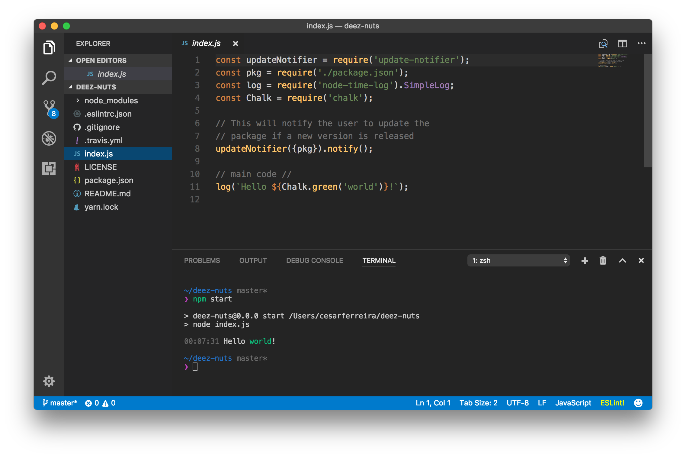

# generator-node-skeleton

> A yeoman generator for node modules

<p align="center">
  
</p>

[![NPM version][npm-image]][npm-url]

## Installation

First, install [Yeoman](http://yeoman.io) and generator-node-skeleton.

```bash
npm install -g yo generator-node-skeleton
```

Then generate your new project:

```bash
yo node-skeleton
```

## License

MIT © [Cesar Ferreira](https://cesarferreira.github.io)

[npm-image]: https://badge.fury.io/js/generator-node-skeleton.svg
[npm-url]: https://npmjs.org/package/generator-node-skeleton
